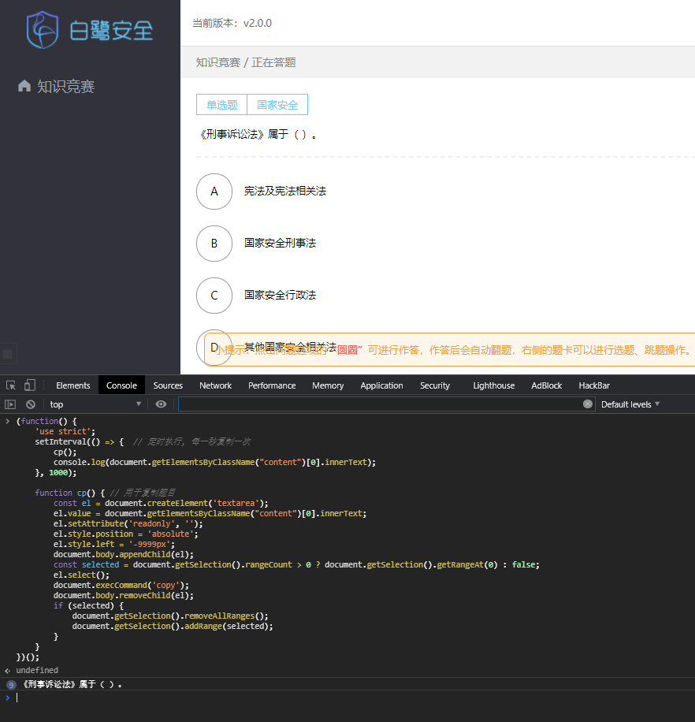
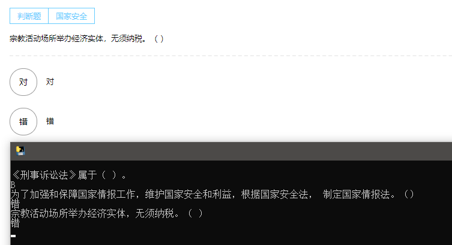

# FxxkBailuSecurity
大学生安全知识竞赛脚本 | 江西省大学生安全知识竞赛 | 白鹭安全

仅供学习使用, 切勿用作非法用途, 搞出什么大新闻不要找我负责!

## 思路
网页端每秒复制试题到剪贴板, Python监听剪贴板内容, 在题库中查找答案并输出.

## 使用方法
* `git clone https://github.com/FupengWang/FxxkBailuSecurity`
* PC浏览器打开你的答题界面"https://seducts.xinhuayinzhou.com/#/competition/answer/12345", 按下F12打开开发者工具, 并选择"Console"
* 打开`./FxxkBailuSecurity/browser.js` 将其中的代码复制到"Console"中. (此时你的Console应该在输出当前题目, 频率1s)
* 打开`./FxxkBailuSecurity/getAnswer.exe`即可看到自动输出的试题答案
* 当然你也可以`pip installer requirements.txt` 后`python getAnswer.py`运行程序

## 说明
* 匹配不到的题目请自行回答, 题库见目录下`2021题库.xls`文件

## 贴图

